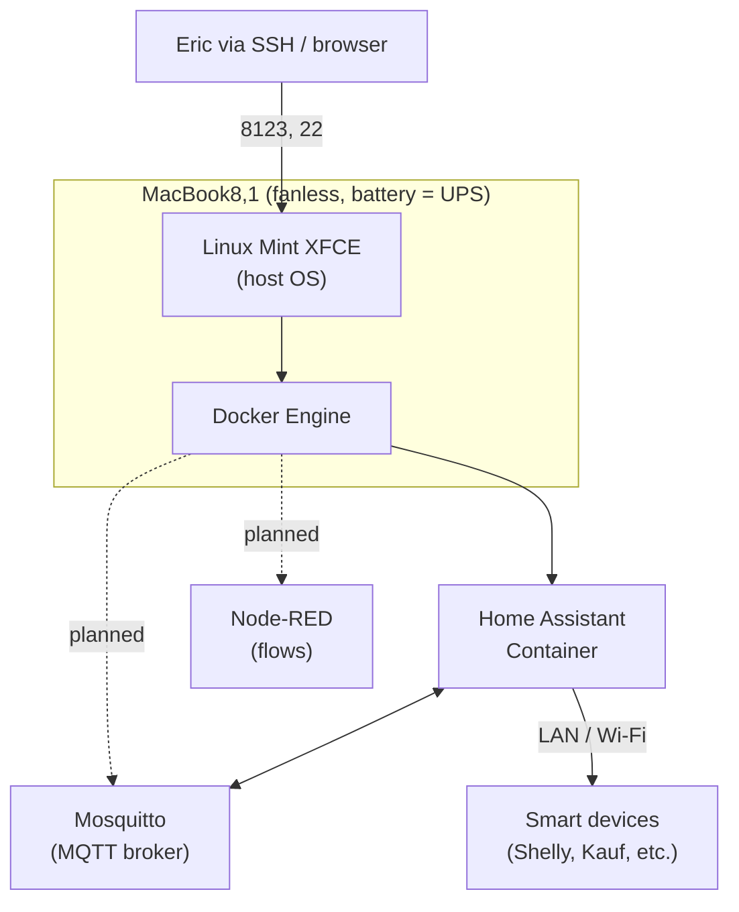

# macbook-home-hub

<!-- CONSTITUTION_START -->
[](https://github.com/esanacore/engineering-constitution)
<!-- CONSTITUTION_END -->

Turning a 2015 12-inch Retina MacBook (`MacBook8,1`, fanless Core M Broadwell,
8 GB soldered RAM, single USB-C) into a silent, always-on Linux tinkering box
that doubles as a home-automation hub running Home Assistant in Docker.

The machine's quirk is its strength here: the built-in battery acts as a free
UPS, so the hub rides through power blips that would hard-cut a Pi or NUC.

Status: early. The Linux base and the Home Assistant install method are
decided (see `docs/adr/`); the specific devices and companion services are
still open.

## Current Capabilities

Honest snapshot of what this repo covers today. This list grows as the project does.

- Documents the target hardware and its Linux-specific gotchas (Broadcom
  BCM4350 Wi-Fi, lid-switch suspend, battery longevity).
- Records the platform decision: lightweight Linux base + Home Assistant
  Container (Docker), not Home Assistant OS.
- Holds the operational runbook for running a laptop as an always-on hub.

Not yet: an actual `docker-compose.yml`, provisioning scripts, or any device
integrations. Those are tracked in `TODO.md`.

## Getting Started

Provisioning steps live in `docs/SETUP.md`. High level:

1. Flash a Linux Mint XFCE (or Fedora XFCE) live USB.
2. Install to the internal SSD, keeping a USB Ethernet/Wi-Fi dongle handy for
   the Broadcom driver gap during install.
3. Apply the always-on operations config (`docs/OPERATIONS.md`).
4. Install Docker and bring up Home Assistant Container.

## Project Structure

```text
macbook-home-hub/
├── compose/         ← docker-compose stack (Home Assistant + companions) [planned]
├── config/          ← Home Assistant + service configuration [planned]
├── scripts/         ← provisioning and maintenance helpers [planned]
├── docs/            ← architecture, operations, ADRs, setup
└── constitution/    ← Eric's Engineering Constitution (git submodule)
```

## System Overview



## Documentation

- Roadmap: `TODO.md`
- Changelog: `CHANGELOG.md`
- Architecture decisions: `docs/adr/`
- Architecture overview and layers: `docs/ARCHITECTURE.md`
- Operations runbook: `docs/OPERATIONS.md`
- Off-the-shelf software inventory: `docs/OTS_SOFTWARE.md`
- Setup: `docs/SETUP.md`

## Contributing

Before completing work:

- Update tests.
- Update documentation.
- Update TODO.md.
- Update CHANGELOG.md for user-facing changes.
- Review security impact.
