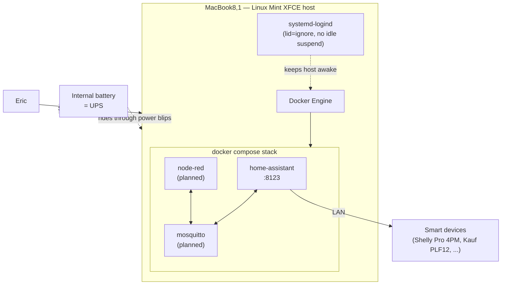

# Architecture

## System Overview

`macbook-home-hub` is a single-node deployment: one physical machine
(`MacBook8,1`) running a lightweight Linux host, with Docker hosting Home
Assistant and, over time, a small set of companion containers. There is no
distributed system and no application code of our own yet — the "architecture"
here is a host OS, a container runtime, and a declarative service stack.

Boundary: everything inside the box is ours to configure; smart devices on the
LAN are external systems Home Assistant talks to over the network.

## Component Diagram

## Data Flow

1. Devices on the LAN report state to Home Assistant (directly, or via MQTT
   through Mosquitto once that is deployed).
2. Home Assistant evaluates automations and pushes commands back to devices.
3. Configuration and automation state live in the Home Assistant config
   volume, bind-mounted from the host so it is backed up and version-adjacent.
4. Eric administers over SSH (host) and the HA web UI (`:8123`).

## Key Technologies

- **Host OS**: Linux Mint XFCE (Fedora XFCE fallback) — see ADR-0002.
- **Runtime**: Docker Engine + Docker Compose.
- **Application**: Home Assistant (Container install), optional Mosquitto and
  Node-RED companions.
- **Infrastructure**: a single fanless laptop; its battery serves as a UPS.

## Repository Structure

- `compose/`: the docker-compose service stack (planned).
- `config/`: Home Assistant and companion-service configuration (planned).
- `scripts/`: provisioning and maintenance helpers (planned).
- `docs/`: architecture, operations, ADRs, setup.
- `constitution/`: universal engineering rules (submodule).

## Layer Boundaries

The Dependency Rule and its `check_architecture.sh` enforcement target
application source code organized into layers (domain / application /
infrastructure). This repository currently holds configuration and
infrastructure-as-declaration (compose files, YAML, shell helpers), not layered
application code, so formal layer enforcement is intentionally not enabled.

If a non-trivial helper program is ever added (for example, a Python service
that bridges a device protocol), declare its layers here at that point and turn
on enforcement. Until then, this is a deliberate, documented N/A rather than an
oversight.
